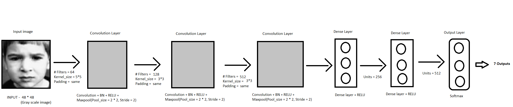

# Face-Emotion-Detection

Identifying facial emotions i.e, *Angry, Disgust, Fear, Happy, Sad, Surprise, Neutral* on webcam feed.

## Overview

The facial emotion detection model is based on three layer convolution plus two dense layers and at output using a softmax layer.
> Architecture - 

- Model created using [Fer2013 dataset](https://www.kaggle.com/c/challenges-in-representation-learning-facial-expression-recognition-challenge/data)

- The Dataset is quite unbalanced with very few representation of *disgust* class.

- To remove above problem I tried some basic data augmentaion with low frequency classes but the result were not that mush satisfying in tested epochs/steps.

- Created model by training for 200 epochs.

- As the model is trained on 48*48 images, for deploying this model to webcam live input we have to apply some preprocessing also.

- So, from input web-cam feed I used face haar-cascades to extract out the images of faces at continuous time frames.

- Then I reshaped the images at each time frame to 48*48 and decolourised them to make web-cam input analogous to the images its been trained on.

## How to Use-

- Clone the repo
- For custom training- run train.ipynb
- For webcam testing- run test.ipynb

## Note- 

- One can also enhance this model with training by higher resolution images and more expanded network.
> But this comes under the expence of more hardware power.
